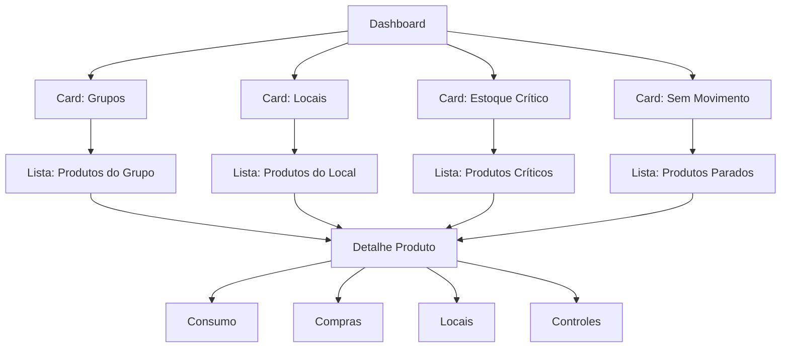

# 🎯 Produtos V2 - Ralph Philosophy Plan

> **Filosofia Ralph:** "Cada clique deve revelar mais contexto. Cada dado deve ser linkado. Zero becos sem saída."

## 📋 Índice

1. [Visão Geral](#visão-geral)
2. [Princípios de Design](#princípios-de-design)
3. [Arquitetura de Navegação](#arquitetura-de-navegação)
4. [Módulos e Funcionalidades](#módulos-e-funcionalidades)
5. [API Endpoints](#api-endpoints)
6. [Tarefas de Implementação](#tarefas-de-implementação)

---

## 🌟 Visão Geral

### O Problema Atual
- Listagens de produtos são isoladas
- Não há navegação contextual (grupo → produtos, local → produtos)
- Dashboard de produtos é genérico, não fornece insights acionáveis
- Dados de estoque, consumo, e histórico estão desconectados

### A Solução V2
Um **ecossistema de produtos totalmente interligado** onde cada elemento é clicável e leva a uma visão contextual. O usuário nunca fica "preso" - sempre pode explorar mais fundo ou voltar.

---

## 🧭 Princípios de Design

### 1. **Tudo é Clicável (Full Linked)**
```
Grupo "PARAFUSOS" → Ver todos produtos do grupo
Local "A1-02-03" → Ver todos produtos neste local
Controle "L" → Ver todos produtos com controle por lote
Fornecedor "ACME" → Ver histórico de compras
```

### 2. **Contexto Sempre Visível**
- Breadcrumbs mostrando caminho de navegação
- Sidebar com filtros ativos destacados
- Cards de resumo no topo de cada listagem

### 3. **URL State Completo**
Cada estado da aplicação refletido na URL:
```
/produtos-v2?grupo=10&local=A1&sort=estoque+asc&view=cards
```

### 4. **Drill-Down Progressivo**
```
Dashboard → Grupo com problema → Produtos críticos → Produto específico → Consumo → Compras
```

### 5. **Cache Agressivo + Prefetch**
- Pré-carregar dados prováveis ao hover
- Cache de 5 minutos para listagens
- Invalidação inteligente após ações

---

## 🗺️ Arquitetura de Navegação

### Mapa de Rotas

```
/produtos-v2
├── /                           # Dashboard principal
├── /listagem                   # Lista completa de produtos
├── /grupo/:codgrupoprod        # Produtos de um grupo específico
├── /local/:codlocal            # Produtos de um local específico
├── /controle/:tipcontest       # Produtos por tipo de controle
├── /marca/:marca               # Produtos de uma marca
├── /estoque-critico            # Produtos abaixo do mínimo
├── /sem-movimento              # Produtos sem movimentação
├── /:codprod                   # Detalhe do produto
│   ├── /consumo                # Histórico de consumo
│   ├── /compras                # Histórico de compras
│   ├── /locais                 # Distribuição por locais
│   └── /controles              # Itens de controle (lotes/séries)
```

### Fluxos de Navegação



---

## 📦 Módulos e Funcionalidades

### 1. Dashboard Principal (`/produtos-v2`)

#### KPIs (Cards Superiores)
| Card | Valor | Ação ao Clicar |
|------|-------|----------------|
| Total Produtos | 5.432 ativos | → Listagem completa |
| Grupos | 45 grupos | → Lista de grupos com contagem |
| Locais | 128 locais | → Lista de locais com contagem |
| Estoque Crítico | 23 produtos | → Lista de críticos |
| Sem Movimento 90d | 156 produtos | → Lista sem movimento |
| Valor Total Estoque | R$ 2.3M | → Análise por valor |

#### Gráficos
- **Distribuição por Grupo** (Pie/Donut) - clicável
- **Top 10 Produtos por Valor** (Bar) - clicável
- **Evolução de Estoque** (Line) - últimos 12 meses
- **Mapa de Calor de Locais** (Heatmap) - clicável

#### Tabela Resumo
- Top 20 produtos mais movimentados
- Colunas: Código, Descrição, Grupo (link), Local (link), Estoque, Último Movimento

---

### 2. Listagem Universal (`/produtos-v2/listagem`)

#### Filtros (Sidebar ou Drawer)
- [ ] Busca texto livre (debounced)
- [ ] Grupo (multi-select com busca)
- [ ] Local (multi-select com busca)
- [ ] Tipo Controle (multi-select)
- [ ] Marca (multi-select)
- [ ] Status Ativo (S/N/Todos)
- [ ] Estoque (Range: min-max)
- [ ] Último Movimento (Date range)
- [ ] Com/Sem Estoque
- [ ] Acima/Abaixo do Mínimo

#### Modos de Visualização
- **Tabela** - Denso, muitos dados
- **Cards** - Visual, com imagem/ícone
- **Compacto** - Apenas essenciais

#### Ações em Massa
- Exportar selecionados (CSV/Excel)
- Alterar grupo em massa
- Marcar como inativo

#### Colunas da Tabela
| Coluna | Ordenável | Linkável |
|--------|-----------|----------|
| Código | ✅ | → Detalhe |
| Descrição | ✅ | → Detalhe |
| Grupo | ✅ | → /grupo/:id |
| Local | ✅ | → /local/:id |
| Controle | ✅ | → /controle/:tipo |
| Estoque | ✅ | - |
| Mín/Máx | ❌ | - |
| Último Mov. | ✅ | - |
| Marca | ✅ | → /marca/:nome |
| Ativo | ✅ | - |

---

### 3. Vista por Grupo (`/produtos-v2/grupo/:codgrupoprod`)

#### Header
- Nome do grupo
- Total de produtos
- Valor total em estoque
- Breadcrumb: Dashboard > Grupos > {Nome}

#### Cards Resumo
- Produtos ativos / inativos
- Com estoque / Sem estoque
- Críticos (abaixo mínimo)

#### Tabela
- Mesma estrutura da listagem universal
- Pré-filtrado pelo grupo
- Link "Ver todos grupos" no header

---

### 4. Vista por Local (`/produtos-v2/local/:codlocal`)

#### Header
- Código e descrição do local
- Hierarquia do local (se houver)
- Total de produtos
- Valor total

#### Visualização Especial
- **Mapa do Local** (se disponível)
- **Lista de Posições** (se local tem subdivisões)

#### Tabela
- Produtos neste local
- Quantidade por produto
- Último movimento

---

### 5. Detalhe do Produto (`/produtos-v2/:codprod`)

#### Tabs
1. **Geral** - Dados cadastrais completos
2. **Estoque** - Por local, mínimos, máximos
3. **Consumo** - Histórico de saídas
4. **Compras** - Histórico de entradas
5. **Controles** - Lotes/Séries (se TIPCONTEST)
6. **Preços** - Histórico de custos

#### Cards Rápidos
- Estoque total
- Valor em estoque
- Média consumo mensal
- Dias de cobertura

#### Links Contextuais
- Grupo: [PARAFUSOS] → clicável
- Local principal: [A1-02-03] → clicável
- Fornecedor principal: [ACME LTDA] → clicável

---

## 🔌 API Endpoints

### Novos Endpoints Necessários

```yaml
# Dashboard
GET /produtos-v2/dashboard/kpis
GET /produtos-v2/dashboard/distribuicao-grupos
GET /produtos-v2/dashboard/top-valor
GET /produtos-v2/dashboard/evolucao-estoque
GET /produtos-v2/dashboard/mapa-locais

# Listagem Universal
GET /produtos-v2/listagem
  ?search=
  &grupos[]=
  &locais[]=
  &controles[]=
  &marcas[]=
  &ativo=
  &estoqueMin=
  &estoqueMax=
  &movimentoDesde=
  &movimentoAte=
  &sort=
  &page=
  &perPage=
  &view=table|cards|compact

# Agregações para Filtros
GET /produtos-v2/filtros/grupos      # Lista grupos com contagem
GET /produtos-v2/filtros/locais      # Lista locais com contagem
GET /produtos-v2/filtros/controles   # Lista tipos controle com contagem
GET /produtos-v2/filtros/marcas      # Lista marcas com contagem

# Vistas Específicas
GET /produtos-v2/grupo/:codgrupoprod/resumo
GET /produtos-v2/grupo/:codgrupoprod/produtos
GET /produtos-v2/local/:codlocal/resumo
GET /produtos-v2/local/:codlocal/produtos

# Detalhe Produto
GET /produtos-v2/:codprod/completo
GET /produtos-v2/:codprod/estoque-por-local
GET /produtos-v2/:codprod/consumo-mensal
GET /produtos-v2/:codprod/historico-compras
GET /produtos-v2/:codprod/controles
GET /produtos-v2/:codprod/historico-precos
```

---

## ✅ Tarefas de Implementação

### Fase 1: Infraestrutura (API)
- [ ] 1.1 Criar módulo `produtos-v2` no NestJS
- [ ] 1.2 Endpoint `/dashboard/kpis` com agregações
- [ ] 1.3 Endpoint `/listagem` com filtros avançados
- [ ] 1.4 Endpoints de agregação para filtros
- [ ] 1.5 Documentação Swagger completa

### Fase 2: Dashboard (Frontend)
- [ ] 2.1 Layout do dashboard com grid de cards
- [ ] 2.2 Componente KPI Card clicável
- [ ] 2.3 Gráfico de distribuição por grupo (Recharts)
- [ ] 2.4 Gráfico top produtos por valor
- [ ] 2.5 Tabela resumo com links

### Fase 3: Listagem Universal (Frontend)
- [ ] 3.1 Sidebar de filtros com multi-select
- [ ] 3.2 Tabela com colunas linkáveis
- [ ] 3.3 Alternância de visualização (table/cards)
- [ ] 3.4 Paginação e ordenação via URL
- [ ] 3.5 Exportação CSV/Excel

### Fase 4: Vistas Contextuais (Frontend)
- [ ] 4.1 Página de grupo com resumo + listagem
- [ ] 4.2 Página de local com resumo + listagem
- [ ] 4.3 Página de controle por tipo
- [ ] 4.4 Breadcrumbs dinâmicos

### Fase 5: Detalhe do Produto (Frontend)
- [ ] 5.1 Layout com tabs
- [ ] 5.2 Tab Geral com dados cadastrais
- [ ] 5.3 Tab Estoque por local
- [ ] 5.4 Tab Consumo com gráfico
- [ ] 5.5 Tab Compras com histórico
- [ ] 5.6 Tab Controles (lotes/séries)

### Fase 6: Polish & Performance
- [ ] 6.1 Prefetch ao hover em links
- [ ] 6.2 Skeleton loading em todas as páginas
- [ ] 6.3 Cache otimizado por rota
- [ ] 6.4 Testes E2E dos fluxos principais
- [ ] 6.5 Documentação final

---

## 🎨 Componentes Reutilizáveis

### Novos Componentes a Criar

```
components/produtos-v2/
├── kpi-card.tsx              # Card de KPI clicável
├── linked-badge.tsx          # Badge que é um link
├── product-table.tsx         # Tabela com colunas linkáveis
├── product-card.tsx          # Card para view de cards
├── filter-sidebar.tsx        # Sidebar de filtros
├── multi-select-filter.tsx   # Multi-select com busca
├── date-range-filter.tsx     # Seletor de período
├── breadcrumb-dynamic.tsx    # Breadcrumb baseado em rota
├── view-toggle.tsx           # Toggle table/cards/compact
├── export-button.tsx         # Exportação CSV/Excel
└── product-detail/
    ├── tabs-container.tsx
    ├── tab-geral.tsx
    ├── tab-estoque.tsx
    ├── tab-consumo.tsx
    ├── tab-compras.tsx
    └── tab-controles.tsx
```

---

## 📐 Wireframes Conceituais

### Dashboard
```
┌─────────────────────────────────────────────────────────────┐
│ [🏠 Dashboard] > Produtos V2                                │
├─────────────────────────────────────────────────────────────┤
│ ┌─────────┐ ┌─────────┐ ┌─────────┐ ┌─────────┐ ┌─────────┐ │
│ │ 5.432   │ │ 45      │ │ 128     │ │ 23 ⚠️   │ │ R$ 2.3M │ │
│ │Produtos │ │ Grupos  │ │ Locais  │ │Críticos │ │ Valor   │ │
│ └─────────┘ └─────────┘ └─────────┘ └─────────┘ └─────────┘ │
├─────────────────────────────────────────────────────────────┤
│ ┌───────────────────────┐ ┌───────────────────────────────┐ │
│ │   Distribuição por    │ │     Top 10 por Valor          │ │
│ │       Grupo           │ │        (Bar Chart)            │ │
│ │    (Pie Chart)        │ │                               │ │
│ └───────────────────────┘ └───────────────────────────────┘ │
├─────────────────────────────────────────────────────────────┤
│ 📋 Produtos Mais Movimentados                               │
│ ┌───────┬────────────────────┬─────────┬────────┬─────────┐ │
│ │ Cód   │ Descrição          │ Grupo   │ Local  │ Estoque │ │
│ ├───────┼────────────────────┼─────────┼────────┼─────────┤ │
│ │ 12345 │ PARAFUSO M6X20     │ PARAF.  │ A1-02  │ 150     │ │
│ │ 12346 │ PORCA SEXT. M6     │ PORCAS  │ A1-03  │ 89      │ │
│ └───────┴────────────────────┴─────────┴────────┴─────────┘ │
└─────────────────────────────────────────────────────────────┘
```

### Listagem com Filtros
```
┌─────────────────────────────────────────────────────────────┐
│ [🏠] > [Produtos V2] > Listagem                             │
├─────────────┬───────────────────────────────────────────────┤
│ FILTROS     │ 🔍 [Buscar...                    ]  [Limpar] │
│             │                                               │
│ Grupos      │ ┌─────┬────────────────┬───────┬─────┬──────┐ │
│ ☑ PARAFUSOS │ │ Cód │ Descrição      │ Grupo │Local│ Est. │ │
│ ☑ PORCAS    │ ├─────┼────────────────┼───────┼─────┼──────┤ │
│ ☐ ARRUELAS  │ │12345│ PARAFUSO M6X20 │PARAF. │A1-02│ 150  │ │
│             │ │12346│ PORCA SEXT. M6 │PORCAS │A1-03│  89  │ │
│ Locais      │ │12347│ PARAFUSO M8X25 │PARAF. │A1-02│  45  │ │
│ ☑ A1-02     │ └─────┴────────────────┴───────┴─────┴──────┘ │
│ ☐ A1-03     │                                               │
│             │ ◀ 1 2 3 ... 50 ▶  [20 por página ▼]          │
│ Estoque     │                                               │
│ [Min] [Max] │ [📊 Tabela] [🗂️ Cards] [📋 Compacto]           │
└─────────────┴───────────────────────────────────────────────┘
```

---

## 🚀 Priorização

### MVP (Semana 1-2)
1. Dashboard com KPIs básicos
2. Listagem universal com busca e ordenação
3. Links funcionais (grupo, local)

### V1 (Semana 3-4)
4. Filtros avançados na listagem
5. Páginas de grupo e local
6. Detalhe do produto básico

### V2 (Semana 5-6)
7. Gráficos no dashboard
8. Tabs completas no detalhe
9. Exportação

### V3 (Futuro)
10. Mapa de locais
11. Prefetch e otimizações
12. Análises preditivas

---

**Ralph says:** "Quando terminar, o usuário vai se sentir navegando em um mapa interativo de produtos, não em planilhas estáticas. Cada clique abre uma porta, nunca fecha." 🍩
